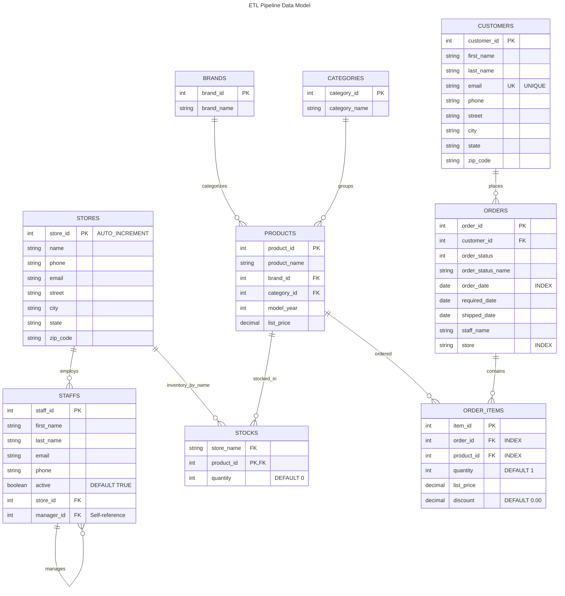

```mermaid
---
title: ETL Pipeline Data Model
---
erDiagram
    %% Core Business Entities
    BRANDS {
        int brand_id PK
        string brand_name
    }
    
    CATEGORIES {
        int category_id PK
        string category_name
    }
    
    STORES {
        int store_id PK "AUTO_INCREMENT"
        string name
        string phone
        string email
        string street
        string city
        string state
        string zip_code
    }
    
    %% Product Management
    PRODUCTS {
        int product_id PK
        string product_name
        int brand_id FK
        int category_id FK
        int model_year
        decimal list_price
    }
    
    STOCKS {
        string store_name FK
        int product_id PK,FK
        int quantity "DEFAULT 0"
    }
    
    %% Staff Management
    STAFFS {
        int staff_id PK
        string first_name
        string last_name
        string email
        string phone
        boolean active "DEFAULT TRUE"
        int store_id FK
        int manager_id FK "Self-reference"
    }
    
    %% Customer & Orders
    CUSTOMERS {
        int customer_id PK
        string first_name
        string last_name
        string email UK "UNIQUE"
        string phone
        string street
        string city
        string state
        string zip_code
    }
    
    ORDERS {
        int order_id PK
        int customer_id FK
        int order_status
        string order_status_name
        date order_date "INDEX"
        date required_date
        date shipped_date
        string staff_name
        string store "INDEX"
    }
    
    ORDER_ITEMS {
        int item_id PK
        int order_id FK "INDEX"
        int product_id FK "INDEX"
        int quantity "DEFAULT 1"
        decimal list_price
        decimal discount "DEFAULT 0.00"
    }

    %% Relationships
    BRANDS ||--o{ PRODUCTS : "categorizes"
    CATEGORIES ||--o{ PRODUCTS : "groups"
    STORES ||--o{ STAFFS : "employs"
    STORES ||--o{ STOCKS : "inventory_by_name"
    PRODUCTS ||--o{ STOCKS : "stocked_in"
    PRODUCTS ||--o{ ORDER_ITEMS : "ordered"
    STAFFS ||--o{ STAFFS : "manages"
    CUSTOMERS ||--o{ ORDERS : "places"
    ORDERS ||--o{ ORDER_ITEMS : "contains"
```